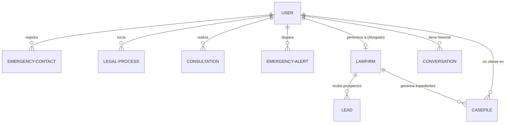
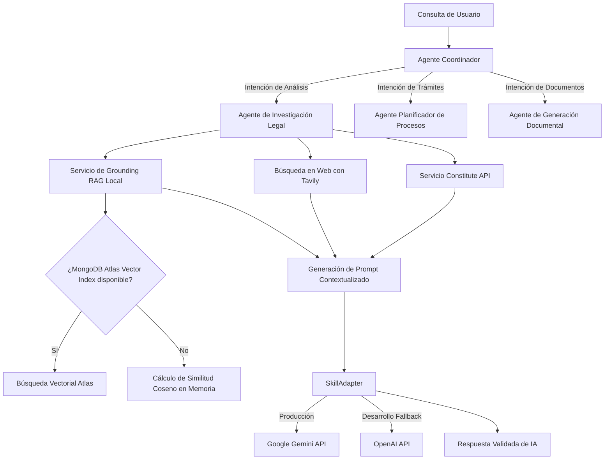

# 📋 Reporte de Auditoría Técnica y Estructural - LeFriApp

Este documento proporciona una auditoría técnica completa y detallada de la plataforma **LeFriApp** (LeFri Platform). Su objetivo es servir como guía inmediata para desarrolladores humanos y agentes de inteligencia artificial, facilitando la comprensión del estado actual del software, la identificación de fallas críticas y la ejecución de refactorizaciones.

---

## 📌 1. Resumen Ejecutivo y Estado General

**LeFriApp** es una plataforma LegalTech B2C orientada a democratizar el acceso a orientación jurídica inicial de forma gratuita, inmediata y asistida por inteligencia artificial (**Google Gemini AI**). 

A nivel técnico, a diferencia de otros proyectos del laboratorio basados en Python/Flask, LeFriApp adopta un stack de desarrollo completo en **JavaScript/TypeScript (MERN/PERN modernizado)**. 

### 🟢 Fortalezas del Proyecto
*   **Modularidad de IA (`SkillAdapter`)**: Cuenta con un adaptador intermedio que permite alternar o realizar failover entre modelos de Google Gemini y OpenAI.
*   **Desacoplamiento de WhatsApp**: Utiliza un microservicio separado (`whatsapp-api`) basado en **Baileys**, lo que previene que las recargas del servidor de IA congelen o desconecten las sesiones WebSocket de WhatsApp.
*   **Cifrado a Nivel de Aplicación**: Encripta de forma transparente campos de datos altamente sensibles (`phone`, `telegramChatId`, `summary`, etc.) antes de guardarlos en MongoDB.
*   **Diseño para Emergencias**: La interfaz del cliente está optimizada para la inmediatez y cuenta con geolocalización e integraciones de voz.

### 🟡 Estado de Deuda Técnica y Correcciones Recientes
*   **Corrección de Búsqueda sobre Campos Cifrados [RESUELTO]**: Se implementaron hashes criptográficos unidireccionales SHA-256 (`phoneHash` y `telegramChatIdHash`) para realizar búsquedas exactas en bases de datos y webhooks de forma segura, eliminando la duplicación infinita de usuarios.
*   **Errores de CORS e Interfaz [RESUELTO]**: Se resolvieron todos los errores de TypeScript (`tsc`) del cliente, agregando cabeceras de credenciales en `fetch` y unificando el tipado de mensajería, idioma y usuarios.
*   **Depreciación de Google Cloud Run y CI/CD [RESUELTO]**: Se eliminó toda dependencia con Google Cloud Platform. El flujo de despliegue ahora es agnóstico a VPS y está orquestado mediante PM2 con el script `deploy.sh`.
*   **Bypass del Repositorio de Persistencia (Pendiente)**: Aunque existe `IStorage` con fallback en memoria, el backend continúa realizando algunas consultas directas de Mongoose en las rutas principales. Esto es seguro si MongoDB está activo, pero limita la resiliencia en memoria.

---

## 🛠️ 2. Arquitectura del Sistema y Directorios

El proyecto está organizado en una estructura limpia de monorepositorio con componentes del frontend y backend en TypeScript:

```
LeFriApp/
├── client/                 # Aplicación Frontend (React + Vite)
│   ├── src/
│   │   ├── components/     # Componentes visuales (UI, Chat, Grabadoras de Voz)
│   │   ├── contexts/       # Contextos globales (Idioma, Traducciones)
│   │   ├── hooks/          # Hooks personalizados (useAuth, useEmergency)
│   │   ├── lib/            # Clientes API, i18n, Temas y utilidades de Query
│   │   ├── pages/          # Páginas principales (Citizen, Lawyer y Admin Dashboards)
│   │   └── types/          # Tipos globales de TypeScript
├── server/                # Aplicación Backend (Node.js + Express)
│   ├── config/            # Configuraciones de servidor
│   ├── services/          # Integraciones externas (Gemini, Constitute, Billing, etc.)
│   ├── utils/             # Funciones criptográficas y utilidades
│   ├── db.ts              # Conexión Mongoose y gestión de fallbacks de red
│   ├── routes.ts          # Definición de más de 30 rutas de la API (Monolítico)
│   └── storage.ts         # Adaptador del patrón Repository (Memory vs. Mongo)
├── shared/                # Código compartido entre Cliente y Servidor
│   └── schema.ts          # Esquemas Mongoose, validaciones Zod y tipos compartidos
│   │   ├── domain/        # Entidades del dominio de WhatsApp
│   │   └── infrastructure/# Servidor Express, router, y WhatsAppManager (Baileys)
└── scripts/               # Scripts de siembra de base de datos, entorno y despliegue
```

---

## 🚨 3. Auditoría de Bugs Críticos y Vulnerabilidades (Estado Actual)

### 🚨 Bug Crítico #1 [RESUELTO]: Fallo de Búsqueda sobre Campo Cifrado (onboarding de WhatsApp y Telegram)
*   **Estado**: **Resuelto** ✅
*   **Solución Aplicada**:
    Se introdujeron campos de hash criptográfico unidireccionales `phoneHash` y `telegramChatIdHash` en [shared/schema.ts](file:///Users/macbook/Desktop/AI_LAB-WLT/LeFriApp/shared/schema.ts) calculados automáticamente en ganchos `.pre('save')` y `.pre('findOneAndUpdate')` utilizando la función hash SHA-256 sobre los números limpios. Las consultas de onboarding en `routes.ts` y `telegram.ts` se re-escribieron para buscar de forma exacta contra los hashes en lugar del texto plano sobre columnas cifradas:
    ```typescript
    const phoneHash = crypto.createHash('sha256').update(phoneCleaned).digest('hex');
    let citizen = await User.findOne({ phoneHash });
    ```

---

### 🚨 Bug Crítico #2 [RESUELTO]: Error de Autorización (403) en el Dashboard de Ciudadanos
*   **Estado**: **Resuelto** ✅
*   **Solución Aplicada**:
    Se creó la ruta dedicada `/api/citizen/cases` en el backend protegida únicamente por la autenticación general del ciudadano (`requireAuth`), la cual lista únicamente los casos donde el usuario autenticado figura como cliente (`clientId`). La interfaz `client/src/pages/citizen-dashboard.tsx` fue enlazada a este nuevo endpoint eliminando las restricciones de acceso 403.

---

### 🚨 Bug Crítico #3 [RESUELTO]: Orden Incorrecto del Middleware de Manejo de Errores
*   **Estado**: **Resuelto** ✅
*   **Solución Aplicada**:
    Se reorganizó la inicialización del servidor Express en `server/index.ts`, moviendo el middleware de errores global al final de la cadena de registro de Express, inmediatamente después de invocar a `registerRoutes(app)`. Ahora las excepciones dentro de las rutas del servidor son capturadas e impresas como respuestas estructuradas en JSON.

---

### 🚨 Bug Crítico #4 [RESUELTO]: Hardcoding de Proveedor de IA en ecosystem.config.cjs
*   **Estado**: **Resuelto** ✅
*   **Solución Aplicada**:
    Se modificó `ecosystem.config.cjs` para evitar el hardcoding. Ahora lee los proveedores por defecto desde las variables de entorno locales con fallback dinámico a Gemini:
    ```javascript
    DEFAULT_LLM_PROVIDER: process.env.DEFAULT_LLM_PROVIDER || 'gemini',
    DEFAULT_LLM_MODEL: process.env.DEFAULT_LLM_MODEL || 'gemini-1.5-flash'
    ```

---

### 🚨 Bug Crítico #5 [MIGRADO / DEPRECIADO]: Despliegue de Google Cloud Run
*   **Estado**: **Depreciado** 🚫
*   **Solución Aplicada**:
    Debido a que el despliegue del proyecto fue re-orientado a ser totalmente independiente de nubes propietarias utilizando PM2, las tuberías de Google Cloud Build (`cloudbuild.yaml`), GitLab CI (`.gitlab-ci.yml`) y los contenedores de Docker fueron depreciados y eliminados del proyecto. El despliegue ahora se realiza a través de `deploy.sh` usando PM2 de manera agnóstica a cualquier VPS.

---

### ⚠️ Bug Menor #6 [RESUELTO]: Credenciales de Desarrollo OAuth Hardcodeadas
*   **Estado**: **Resuelto** ✅
*   **Solución Aplicada**:
    El servicio de autenticación de Google en `server/services/google-auth.ts` fue saneado y ahora requiere y valida la presencia de `GOOGLE_OAUTH_REDIRECT_URI` y las variables correspondientes cargadas en el entorno local a través del archivo `.env`.

---

### ⚠️ Bug Menor #7 [RESUELTO]: Petición del Chat de Streaming Omite Credenciales de Sesión
*   **Estado**: **Resuelto** ✅
*   **Solución Aplicada**:
    Se actualizaron las peticiones de fetch directo a `/api/ask` en `streaming-chat-interface.tsx` y `chat-interface.tsx` para incluir la opción `credentials: 'include'`. Esto garantiza la persistencia e inyección de la cookie de sesión de Express en entornos de producción distribuidos y peticiones CORS.

---tend y el backend operen bajo distintos subdominios o configuraciones específicas de CORS, las cookies de sesión de Express no serán transmitidas en la solicitud de chat, resultando en un error **401 Unauthorized**.
*   **Solución**:
    Modificar la llamada `fetch` para incluir explícitamente `credentials: 'include'` en sus opciones de inicialización.

---

## 🔄 4. Inconsistencias Arquitectónicas e Implementación

### 1. Duplicación de Modelos Mapeados y el Patrón Repository
En [server/storage.ts](file:///Users/macbook/Desktop/AI_LAB-WLT/LeFriApp/server/storage.ts) se expone la interfaz `IStorage` que implementa dos almacenamientos: `MemoryStorage` y `MongoStorage`. La idea detrás de este diseño es que si el servidor pierde conexión con MongoDB, este "falla amigablemente" en memoria (`executeWithRetry`).
**Inconsistencia**: 
El 90% del backend en [server/routes.ts](file:///Users/macbook/Desktop/AI_LAB-WLT/LeFriApp/server/routes.ts) ignora la variable `storage` (instancia de `MongoStorage`) e importa y consulta los modelos de Mongoose directamente.
Esto destruye el propósito del patrón Repository. Si MongoDB cae, operaciones como registrar un despacho de abogados, cargar prospectos (Leads) o verificar administradores en la base de datos de PM2 causarán una excepción inmanejable en lugar de hacer fallback en memoria.

### 2. Violación del Principio de Responsabilidad Única (Routes Monolítico)
El archivo `server/routes.ts` cuenta con **más de 2490 líneas de código**. Contiene:
*   Manejo y validación de sesiones.
*   Configuraciones locales de carga de archivos (Multer).
*   Lógica y flujos de webhook para WhatsApp y Telegram.
*   Cálculo de matchmaking para asignación de abogados.
*   Generación y parsing de PDFs dinámicos utilizando Puppeteer.
*   Integraciones con pasarelas de pago y webhooks de dLocal Go y PayPal.

Esto incrementa el acoplamiento y dificulta la depuración. Es necesario segmentar las rutas en múltiples controladores especializados (ej. `auth.routes.ts`, `case.routes.ts`, `webhook.routes.ts`, `billing.routes.ts`).

---

## 🔋 5. Estado de la Base de Datos y Modelos (MongoDB)

El diseño del modelo de datos está definido en [shared/schema.ts](file:///Users/macbook/Desktop/AI_LAB-WLT/LeFriApp/shared/schema.ts) utilizando esquemas de Mongoose con soporte para validación Zod en la transferencia de datos.

### Diagrama de Relaciones de la Base de Datos (Mongoose)



### Tabla de Entidades y Propiedades Clave

| Colección/Modelo | Propósito | Características de Seguridad/RAG |
| :--- | :--- | :--- |
| **User** | Gestiona ciudadanos, abogados y administradores del sistema. | Encripta los campos `phone` y `telegramChatId`. |
| **LawFirm** | Representa los bufetes de abogados registrados (Tenants). | Configura el límite de asesorías gratuitas (ProBono) según el plan. |
| **WhatsAppSession**| Almacena las sesiones activas WebSocket de Baileys. | Cifra la propiedad `creds` para evitar robo de identidad de sesión. |
| **Lead** | Prospección y CRM para abogados. | Encripta campos como el `summary` del caso del usuario. |
| **CaseFile** | ERP de expedientes judiciales para abogados. | Encripta descripciones y el texto extraído (OCR) de documentos PDF. |
| **EmergencyContact**| Contactos del ciudadano para alertas SOS. | Encripta el campo `phone`. |
| **LegalProcess** | Pasos y estado de trámites guiados por IA. | Mapea estructuras complejas (Steps, timeline y bases constitucionales). |
| **Consultation** | Historial de preguntas resueltas por RAG. | Cifra la pregunta (`query`) y respuesta final. |
| **EmergencyAlert** | Registro de alertas SOS detonadas. | Cifra ubicación geográfica e historial de notificados. |
| **LegalDocument** | Base de conocimientos legal para RAG. | Contiene el vector `embedding` (768D) del contenido de la ley. |
| **Conversation** | Memoria contextual del bot conversacional. | Mantiene los últimos mensajes por sesión y metadatos. |

---

## 🤖 6. Estado de la Inteligencia Artificial y Grounding (RAG)

El motor inteligente de LeFriApp opera bajo una arquitectura de orquestación multi-agente diseñada para mitigar las alucinaciones del LLM en el sector legal:



### Desempeño del Grounding RAG Local:
1.  **Cálculo de Embeddings**: Al guardar un documento legal en [seed-laws.ts](file:///Users/macbook/Desktop/AI_LAB-WLT/LeFriApp/scripts/seed-laws.ts), se solicita un vector a Gemini utilizando el modelo `text-embedding-004`.
2.  **Búsqueda Atlas Vectorial**: El servicio realiza una consulta `$vectorSearch` sobre el índice de MongoDB.
3.  **Similitud Coseno Local (In-Memory)**: Si la base de datos se ejecuta de forma local (sin Atlas), el sistema descarga los documentos y ejecuta un cálculo de similitud coseno en memoria:
    $$\text{Similitud} = \frac{\mathbf{A} \cdot \mathbf{B}}{\|\mathbf{A}\| \|\mathbf{B}\|}$$
    Esto asegura la resiliencia en entornos de desarrollo sin dependencias de infraestructura en la nube.

---

## 📦 7. Estado de Despliegue y CI/CD

El proyecto ha sido simplificado y re-orientado por completo para ser **agnóstico al entorno de nube**, eliminando toda dependencia con Google Cloud Platform (GCP), Google Cloud Run y Google Cloud Build.

### A. Despliegue en Servidores VPS / Entornos PM2:
*   El script de automatización [deploy.sh](file:///Users/macbook/Desktop/AI_LAB-WLT/LeFriApp/deploy.sh) se encarga de:
    1.  Verificar y validar la presencia de variables de entorno críticas (`MONGODB_URI`, `GEMINI_API_KEY`, `SESSION_SECRET`) en el archivo `.env`.
    2.  Instalar dependencias del cliente y del servidor utilizando la bandera `--include=dev` para garantizar la presencia de herramientas de empaquetado (`vite`, `esbuild`) incluso en configuraciones de producción.
    3.  Compilar el frontend de React/Vite y empaquetar el servidor de Node en `dist/index.js`.
    4.  Instalar dependencias y compilar el microservicio de WhatsApp (`whatsapp-api`) mediante TypeScript hacia `whatsapp-api/dist/app.js`.
    5.  Lanzar y orquestar ambos procesos en PM2 utilizando el archivo centralizado `ecosystem.config.cjs` en modo fork con reinicio automático por memoria (`max_memory_restart: '500M'`).
    6.  Ejecutar `pm2 save` para persistir la configuración de arranque en caso de reinicios del sistema operativo.

### B. Google Cloud Run (Depreciado y Eliminado):
*   Se eliminaron todos los archivos relacionados con el pipeline de nube de Google (`cloudbuild.yaml`, `.gitlab-ci.yml`, `Dockerfile` principal y de `whatsapp-api`) para mantener el repositorio limpio y evitar confusiones en futuros despliegues en servidores VPS tradicionales.

---

## 🗺️ 8. Plan de Acción Recomendado (Roadmap de Correcciones)

### Fase 1: Correcciones de Emergencia (Hotfixes Obligatorios)
*   [x] **Corrección del Cifrado del Teléfono**: Modificación de `shared/schema.ts` introduciendo hashes SHA-256 (`phoneHash` y `telegramChatIdHash`).
*   [x] **Refactorizar Búsquedas en Webhooks**: Búsquedas por coincidencia exacta usando `phoneHash` y `telegramChatIdHash` en webhooks de WhatsApp y bots de Telegram.
*   [x] **Modificar la ruta de Casos del Ciudadano**: Endpoint exclusivo `/api/citizen/cases` creado y enlazado en `citizen-dashboard.tsx` para evitar errores 403.
*   [x] **Reordenar middleware de Errores**: Middleware de manejo global de excepciones relocalizado al final de `server/index.ts`.
*   [x] **Corrección de Errores de Tipado General**: Solucionado el 100% de errores del compilador (`tsc`) en el frontend y backend.
*   [x] **Corrección de Binarios Corruptos**: Solucionado el fallo SIGBUS (Bus Error 10) al reinstalar limpiamente el binario nativo de Rollup.

### Fase 2: Configuración e Infraestructura de Producción
*   [x] **Actualizar variables de PM2**: Limpieza y desacoplamiento de variables de OpenAI de `ecosystem.config.cjs` para usar variables dinámicas de Gemini por defecto.
*   [x] **Limpieza de Tuberías Obsoletas**: Eliminación definitiva de Cloud Run, Dockerfiles y configuraciones CI/CD obsoletas.
*   [x] **Configurar Script de Siembra (Seeder)**: Creado `scripts/seed.ts` para inyectar de forma directa usuarios de prueba (`citizen@lefri.ai`, `lawyer@lefri.ai`, `admin@lefri.ai`) en MongoDB.
*   [x] **Eliminar URLs OAuth por defecto**: Reemplazar valores de desarrollo por defecto en `google-auth.ts` por excepciones de validación si faltan variables.

### Fase 3: Refactorización Estructural (Mantenibilidad)
*   [x] **Segmentar `routes.ts`**: Dividir el archivo de rutas en controladores temáticos y routers independientes utilizando Express Router.
*   [x] **Migrar Consultas Directas al Repository**: Encapsular todas las llamadas directas de Mongoose en métodos del adaptador `storage` en `server/storage.ts`.
